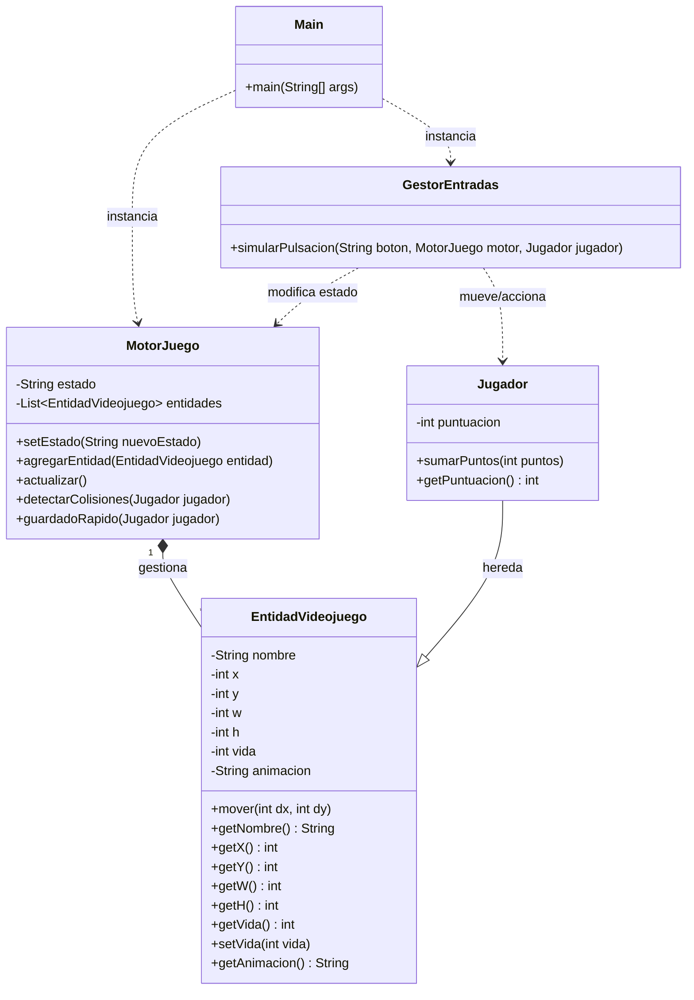
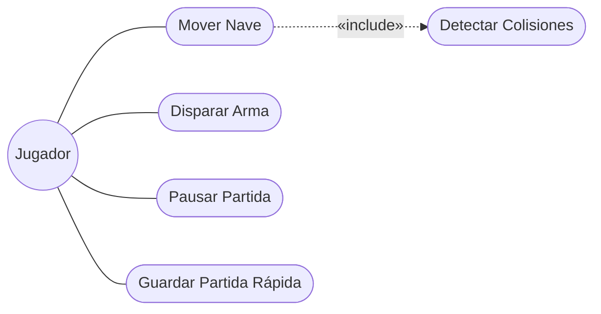

# 🚀 Space Defender - Motor Core 2D

## 📖 Título y Temática Elegida
**Space Defender** es la simulación del núcleo lógico de un videojuego 2D de scroll vertical. El jugador controla una nave ("Nave Defensora") que debe esquivar o destruir entidades enemigas (como asteroides) mientras acumula puntos y gestiona su nivel de vida o energía.

## 🏗️ Arquitectura del Software
El sistema está diseñado siguiendo el Principio de Responsabilidad Única (SRP) de SOLID, limitando el diseño a 5 clases esenciales para garantizar un bajo acoplamiento:
1. **Main**: Clase conductora que actúa como punto de entrada y simula el bucle de juego y las entradas por consola.
2. **MotorJuego**: El "cerebro". Centraliza la lista de entidades, controla la máquina de estados (MENU, JUGANDO, PAUSA) y contiene la lógica matemática de las colisiones y el sistema de guardado rápido.
3. **EntidadVideojuego**: Clase base que encapsula las propiedades físicas (coordenadas, tamaño) y de estado (vida, nombre, animación) de cualquier objeto en pantalla.
4. **Jugador**: Hereda de `EntidadVideojuego`, añadiendo atributos específicos como la puntuación y responsabilidades propias del protagonista.
5. **GestorEntradas**: Desacopla la interpretación de los comandos del usuario, traduciendo "botones" en acciones directas sobre el Motor o el Jugador.

---

## 📊 Diagrama de Clases UML

---

## 👤 Diagrama de Casos de Uso UML

---

## 📋 Especificación de Casos de Uso

### Caso de Uso 1: Mover Nave
| Campo | Descripción |
| :--- | :--- |
| **Nombre** | CU-01 Mover Nave |
| **Objetivo** | Desplazar la nave del jugador a unas nuevas coordenadas en la pantalla. |
| **Actor Principal** | Jugador. |
| **Precondiciones** | El sistema debe estar en estado "JUGANDO" y la entidad Jugador debe estar viva (vida > 0). |
| **Flujo Principal** | 1. El jugador pulsa un botón de dirección (ej. "ARRIBA"). 2. El GestorEntradas intercepta el comando. 3. Se invoca el método mover() del Jugador actualizando sus coordenadas X/Y. 4. El sistema notifica el cambio de posición por consola. |
| **Flujos Alternativos** | Si la nave intenta moverse fuera de los límites de la pantalla, el movimiento se anula y las coordenadas se mantienen igual. |
| **Postcondiciones** | El jugador tiene nuevas coordenadas y se evalúa si en su nueva posición colisiona con algún enemigo. |
| **Reglas de Negocio** | La velocidad de desplazamiento está predefinida por el sistema y no puede ser alterada por el usuario. |

### Caso de Uso 2: Guardar Partida Rápida
| Campo | Descripción |
| :--- | :--- |
| **Nombre** | CU-02 Guardado Rápido (Quick Save) |
| **Objetivo** | Exportar el estado actual de la partida para no perder el progreso. |
| **Actor Principal** | Jugador. |
| **Precondiciones** | Debe haber una partida iniciada con al menos una entidad Jugador registrada en el MotorJuego. |
| **Flujo Principal** | 1. El jugador acciona el comando de guardado. 2. El MotorJuego recopila el estado actual, las coordenadas del jugador, su vida y puntuación. 3. El sistema formatea los datos en una cadena JSON. 4. Se muestra un log de confirmación de guardado. |
| **Flujos Alternativos** | Si el motor detecta que el jugador está muerto, se aborta el guardado. |
| **Postcondiciones** | Se genera un string con los datos exportados sin interrumpir el flujo del juego. |
| **Reglas de Negocio** | El guardado rápido sobrescribe cualquier guardado rápido anterior automáticamente. |

---

## 🤖 Bitácora del Uso de Inteligencia Artificial

* **Herramienta utilizada y rol:** Google Gemini. Rol asignado: Asistente de arquitectura de software, generador de código base y consultor de metodologías GitFlow.
* **Muestra de Prompts:**
  1. *"Actúa como un experto en Java y dame el código para la clase MotorJuego y EntidadVideojuego cumpliendo un diseño orientado a objetos estricto y sin interfaz gráfica limitando todo a un máximo de 6 clases."*
  2. *"Necesito implementar una funcionalidad avanzada de 'Guardado Rápido' que extraiga los datos de la partida y los devuelva en un String simulando un JSON. Inclúyelo en el MotorJuego."*
* **Control de Errores de la IA:** Durante la generación de la clase `EntidadVideojuego`, la IA definió el atributo privado `animacion` en el constructor, pero olvidó generar su respectivo método getter, lo que provocó un warning de variable no utilizada en VS Code. Detecté este fallo leyendo el código y le exigí a la IA la corrección, añadiendo `public String getAnimacion() { return animacion; }` para mantener la encapsulación perfecta. Además, tuve que guiarla estrictamente para aplicar los Conventional Commits.
* **Reflexión Crítica:** Programar bajo presión asistido por IA es útil para crear la estructura *boilerplate* (getters, constructores) y diagramas UML rápidamente. Sin embargo, el peligro es la pérdida de control arquitectónico; si no revisas el código, te arriesgas a incumplir restricciones como el límite de clases. El factor humano sigue siendo vital para orquestar la integración continua (GitFlow) y asegurar la coherencia del proyecto.

